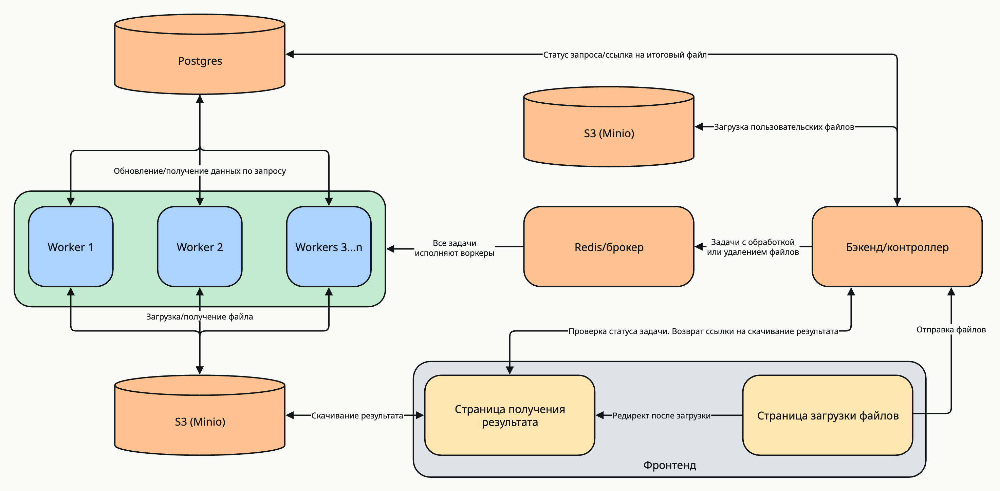

# Распределенный обработчик картинок

Распределенная система для обработки изображений с возможностью добавления водяных знаков. Поддерживает масштабирование на множество рабочих узлов для параллельной обработки.

## Над проектом работали
- **Комаров Иван** — [gagarinkomar](https://github.com/gagarinkomar)
- **Скворцов Алексей** — [Rattysed](https://github.com/Rattysed)
- **Жуков Кирилл** — [llirikhh](https://github.com/llirikhh)
- **Шубин Владислав** — [VS-CDR](https://github.com/VS-CDR)
- **Семенищев Андрей** — [semenishchev-ai](https://github.com/semenishchev-ai)
- **Яфаров Руслан** — [afarovruslan](https://github.com/afarovruslan)

## Требования
- Docker Compose
- Для HTTPS: доменное имя и certbot

## Установка и запуск

### Общие шаги
```bash
# Клонирование репозитория
git clone https://github.com/Rattysed/distributed-image-converter.git
cd distributed-image-converter

# Создание файла конфигурации
cp .env.example .env
```

Настройте переменные в файле `.env` в соответствии с вашими требованиями.

### Вариант 1: Запуск с HTTPS
Замените `example.com` на ваш домен:
```bash
# Получение SSL-сертификата
sudo certbot certonly --standalone -d example.com

# Настройка конфигурации nginx
sed -i 's/yourdomain\.com/example.com/g' nginx/nginx.conf

# Запуск контейнеров
docker compose up --build -d
```

### Вариант 2: Запуск с HTTP
```bash
# Использование HTTP-конфигурации nginx
cp nginx/nginx.conf.http_only nginx/nginx.conf

# Запуск контейнеров
docker compose up --build -d
```

## Сценарий использования
1. Пользователь заходит на сайт для добавления водяного знака на изображения
2. Загружает одну или несколько картинок через форму
3. Система перенаправляет на страницу ожидания с уникальным идентификатором задачи
4. После обработки на странице появляется ссылка для скачивания архива с результатами
5. Ссылка на результат действительна в течение 1 часа
6. Через час после завершения задачи все файлы автоматически удаляются

## Расширение функционала (для администраторов)
Система поддерживает добавление новых типов обработки изображений:

1. В файле `backend/file_requests/image_tasking.py` находится абстрактный класс
2. Для создания новой задачи обработки необходимо унаследоваться от этого класса и реализовать метод `edit`
3. Пример реализации водяного знака можно найти в `backend/file_requests/custom_image_handler.py`

## Архитектура системы

### Использованные технологии
- Django
- S3 (Minio)
- Postgres
- Celery
- Redis

### Принципы работы
- Загруженные пользователем файлы обрабатываются параллельно с помощью Celery. Несколько рабочих узлов (в примере их 2) подключаются по HTTP к Redis и получают задачи от контроллера
- Синхронизация состояний задач осуществляется через PostgreSQL
- Файлы синхронизируются через S3
- Система легко масштабируется на любое число рабочих узлов, которые могут быть запущены на разных хостах независимо от контроллера

## Схема сетевого взаимодействия
Взаимодействие пользователя с приложением управляется через nginx:

## Запуск скриптов для нагрузочного тестирования

